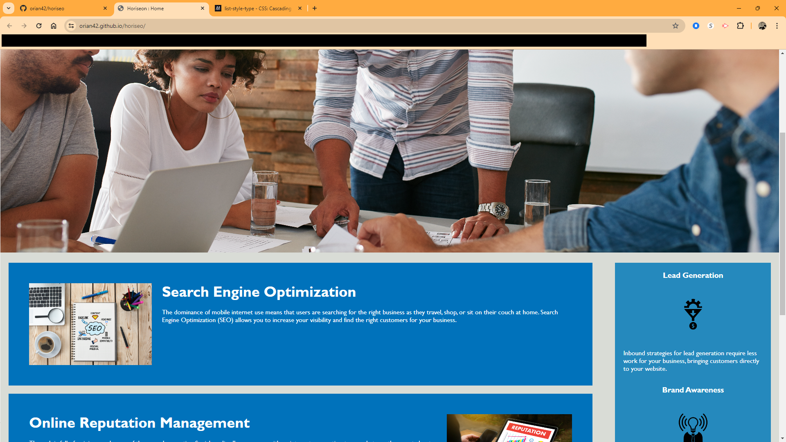

# Horiseo Webpage (Module 1 Challenge)

## Description

I was given the assignment of refracting the code for the Horiseo home page to make it more accessable.  This was an opportunity to put into practice the principles I learned during my first week of the Bootcamp.  I looked forward to the opportunity to be able to prove to myself that I am able to do this in a more-or-less "real world" setting.  In reviewing the code, I noticed that the images did not have any alt attributes associated with them.  I fixed these by adding descriptions of the images.  I also noted noted that the list items in the unordered list were stretched out a bit taking up multiple lines.  I compated these a littel bit to give the HTML a less-cluttered appearance.  I saw that the hyperlinks at the top of the page did not point to any URL's but ionstead pointed to sections and were linked by their identifiers instead.  I did not know you could do this so that was a good learning experience for me.  Moving to the CSS stylesheet, I noticed that each section on the left side of the page and each section on the right side of the page each had its own class to define the formatting of the corresponding section.  I also noted that there were more specific formatting classes for items that were within that class.  I noticed that all the sections on the left side were identical in formatting and much of this duplication was unnecessary.  Therefore, I deleted all duplicate code leaving only one version of the class and underlying elemental formatting.  I renamed these and the CSS is much shorter while accomplishing the same thing.  The right side formatting was different from the left but also had identical bits of code that could be shortened.

## Usage

To view the webpage, navigate to [https://orian42.github.io/horiseo/](https://orian42.github.io/horiseo/)

The webpage is to be viewed by my cohort instructors and fellow classmates.  This webpage is not to be used in a "real world" scenario as it is only a training exercise.  No "real world" business or entity should be inferred by this webpage.

## Credits

The initial code was provided by my Bootcamp instructors.  The template for this README was taken from the pre-work modules of the class.

## License

Please refer to the LICENSE in the repo.
